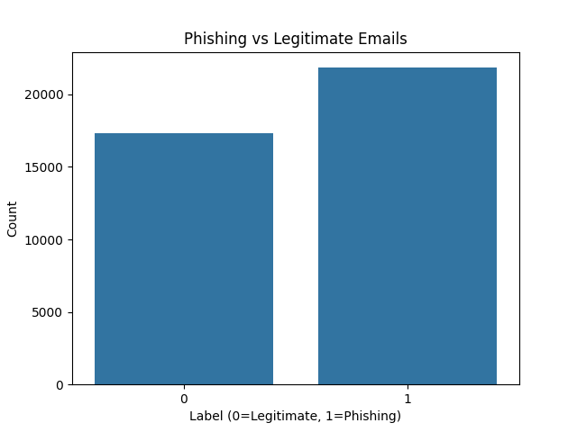

# 📧 Phishing Email Detection Using Machine Learning

## 🧠 Project Overview  
This project uses machine learning to detect phishing emails based on their content and metadata. Phishing emails are fraudulent messages meant to steal sensitive information like passwords and credit card numbers. Automatically identifying them helps users stay safe online.

## 📂 Dataset  
The dataset contains over 39,000 emails with the following features:
- `subject`: The email subject line  
- `body`: The email body  
- `urls`: Number of URLs in the email  
- `label`: 1 = phishing, 0 = legitimate

## ⚙️ Approach  
- Filled missing values in `subject` and `receiver` fields  
- Combined `subject` and `body` into a new `text` column  
- Converted `text` into numerical features using **TF-IDF vectorization**  
- Added number of URLs as a numeric feature  
- Trained a **Logistic Regression** classifier  
- Evaluated the model with **precision**, **recall**, and **f1-score**

## 📊 Label Distribution

This chart shows how many emails in the dataset are phishing vs legitimate:



## ✅ Results  
- **Accuracy**: 99% on test data  
- **Precision/Recall** for phishing emails: ~0.99  
- Model performs well on both classes with balanced support

## 🚀 How to Run

1. Clone this repository  
2. Install the required packages:
   ```bash
   pip install pandas scikit-learn numpy scipy matplotlib seaborn
Run the Python script or the Jupyter notebook (Colab-compatible) to train and test the model.

📌 Example Workflow (Colab)
Upload CEAS_08.csv or your dataset

Preprocess and vectorize the data

Train and evaluate the model

Visualize the results

💡 Future Improvements
Add interpretability tools like SHAP or word clouds

Build a simple Streamlit or web app to make predictions interactively

Create a blog post or report to explain the project clearly

Package the project with tests and cleaner structure

👤 Author
Mohammad Kasra Abdollahi
